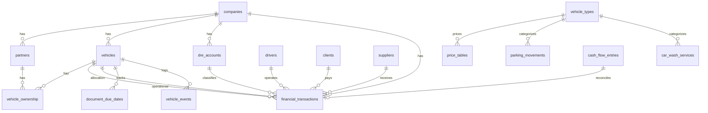

# GRX Management — Modelagem das Planilhas

Versão: 1.0  
Data: 02/07/2026  
Status: Aprovado para modelagem de banco de dados

Este documento mapeia cada aba da planilha Excel para entidades, campos e relacionamentos do sistema.

---

## 1. Visão geral do mapeamento

| Aba Excel | Tipo | Entidade(s) Sistema | Prioridade |
|-----------|------|---------------------|------------|
| Contas DRE e Classificações | Referência | `dre_accounts` | Alta |
| Controle financeiro | Transacional | `financial_transactions` | Alta |
| Fluxo de caixa | Transacional | `cash_flow_entries` | Alta |
| Relatório | Analítico | Views / relatórios | Média |
| Dashboard_GRX | Analítico | View `vw_dashboard_fleet` | Alta |
| Cadastro_Socios | Cadastro | `partners` | Alta |
| Cadastro_Veiculos | Cadastro | `vehicles` | Alta |
| Participacao_Veiculo | Relacionamento | `vehicle_ownership` | Alta |
| Modelo_Sistema_GRX | Documentação | — | — |
| Listas_GRX | Referência | Domínios / enums | Alta |
| Dashboard_Participacao | Analítico | View `vw_partner_attribution` | Alta |
| Dashboard_Veiculos | Analítico | View `vw_vehicle_performance` | Alta |
| Cadastro_Motoristas | Cadastro | `drivers` | Alta |
| Dashboard_Motoristas | Analítico | View `vw_driver_performance` | Média |
| Cadastro_Clientes_GRX | Cadastro | `clients` | Alta |
| Cadastro_Fornecedores_GRX | Cadastro | `suppliers` | Alta |
| Categorias_GRX_V3 | Referência | `lookup_categories` | Média |
| Historico_Veiculos_GRX | Transacional | `vehicle_events` | Média |
| Agenda_Vencimentos_GRX | Transacional | `document_due_dates` | Alta |
| Base_GRX_V3 | Calculado | View `vw_ownership_base` | Alta |
| Dashboard_Executivo_GRX | Analítico | View `vw_executive_dashboard` | Alta |
| Cadastro_Tipos_Veiculos | Cadastro | `vehicle_types` | Alta |
| Tabela_Precos_Vigencia | Cadastro | `price_tables` | Alta |
| Controle_Estacionamento | Transacional | `parking_movements` | Alta |
| Controle_Lava_Rapido | Transacional | `car_wash_services` | Alta |
| Dashboard_Estac_Lava | Analítico | View `vw_parking_wash_dashboard` | Alta |

---

## 2. Mapeamento detalhado por aba

### 2.1 Contas DRE e Classificações → `dre_accounts`

| Coluna Planilha | Campo Sistema | Tipo | Cadastro/Calculado |
|-----------------|---------------|------|--------------------|
| Conta DRE | name | text | Cadastro |
| Classificação | classification | enum | Cadastro |
| Tipo | transaction_type | enum | Cadastro |

**Relacionamentos:** 1:N com `financial_transactions` e `cash_flow_entries`

---

### 2.2 Controle financeiro → `financial_transactions`

| Coluna Planilha | Campo Sistema | Tipo | Cadastro/Calculado |
|-----------------|---------------|------|--------------------|
| Data | transaction_date | date | Cadastro |
| Valor | amount | decimal | Cadastro |
| Cliente/Fornecedor | client_id / supplier_id | FK | Cadastro |
| Data do Serviço | service_date | date | Cadastro |
| Motorista | driver_id | FK | Cadastro |
| Van | operational_vehicle_id | FK | Cadastro |
| Descrição | description | text | Cadastro |
| Conta DRE | dre_account_id | FK | Cadastro |
| Classificação | classification | enum | **Calculado** (via DRE) |
| Tipo | transaction_type | enum | **Calculado** (via DRE) |
| Rateio | allocation_vehicle_id | FK | Cadastro |

**Relacionamentos:**
- → `dre_accounts`
- → `vehicles` (operacional e rateio)
- → `drivers`
- → `clients` / `suppliers`

---

### 2.3 Fluxo de caixa → `cash_flow_entries`

| Coluna Planilha | Campo Sistema | Tipo | Cadastro/Calculado |
|-----------------|---------------|------|--------------------|
| Data | due_date | date | Cadastro |
| Valor | amount | decimal | Cadastro |
| Cliente/Fornecedor | client_id / supplier_id | FK | Cadastro |
| Data do Serviço | service_date | date | Cadastro |
| Motorista | driver_id | FK | Cadastro |
| Van | vehicle_id | FK | Cadastro |
| GR (descrição) | description | text | Cadastro |
| Conta DRE | dre_account_id | FK | Cadastro |
| Classificação | classification | enum | **Calculado** |
| Tipo | transaction_type | enum | **Calculado** |

**Campos adicionais no sistema:**
- `status`: Projetado, Realizado, Cancelado
- `realized_transaction_id`: FK para `financial_transactions` (conciliação RN-033)

---

### 2.4 Cadastro_Socios → `partners`

| Coluna Planilha | Campo Sistema | Tipo |
|-----------------|---------------|------|
| Código Sócio | code | text |
| Nome Sócio | name | text |
| Tipo | partner_type | enum (Sócio, Parceira, Empresa) |
| Status | status | enum |
| Observações | notes | text |
| Usar em Rateio? | use_in_allocation | boolean |

---

### 2.5 Cadastro_Veiculos → `vehicles`

| Coluna Planilha | Campo Sistema | Tipo | Cadastro/Calculado |
|-----------------|---------------|------|--------------------|
| Código Veículo | code | text | Cadastro |
| Van / Placa | plate | text | Cadastro |
| Modelo | model | text | Cadastro |
| Ano | year | integer | Cadastro |
| Responsável Operacional | operational_partner_id | FK | Cadastro |
| Status | status | enum | Cadastro |
| Tipo | vehicle_category | enum | Cadastro |
| Observações | notes | text | Cadastro |
| Receita Total | total_revenue | decimal | **Calculado** |
| Despesa Total | total_expense | decimal | **Calculado** |
| Resultado | total_result | decimal | **Calculado** |

---

### 2.6 Participacao_Veiculo → `vehicle_ownership`

| Coluna Planilha | Campo Sistema | Tipo |
|-----------------|---------------|------|
| Van / Placa | vehicle_id | FK |
| Sócio | partner_id | FK |
| Percentual | ownership_percentage | numeric(5,2) — 0,01 a 100,00 |
| Data Início | effective_date | date |
| Data Fim | end_date | date |
| Status | status | enum |

**Cardinalidade:** N:N entre `vehicles` e `partners`

---

### 2.7 Cadastro_Motoristas → `drivers`

| Coluna Planilha | Campo Sistema | Tipo |
|-----------------|---------------|------|
| Código Motorista | code | text |
| Nome Motorista | name | text |
| Tipo | driver_type | enum |
| Status | status | enum |
| Telefone | phone | text |
| CPF/CNPJ | document | text |
| — | cnh_number | text (cadastro no sistema) |
| — | cnh_expiry_date | date (cadastro no sistema) |
| — | cnh_categories | text[] — A, B, C, D, E, AB, AC, AD, AE (cadastro no sistema) |
| Observações | notes | text |
| Usar em Operação? | active_for_operations | boolean |

---

### 2.8 Cadastro_Clientes_GRX → `clients`

| Coluna Planilha | Campo Sistema | Tipo |
|-----------------|---------------|------|
| Código Cliente | code | text |
| Nome Cliente | name | text |
| CNPJ/CPF | document | text |
| Contato | contact_name | text |
| Telefone | phone | text |
| Cidade | city | text |
| Status | status | enum |
| Observações | notes | text |

---

### 2.9 Cadastro_Fornecedores_GRX → `suppliers`

| Coluna Planilha | Campo Sistema | Tipo |
|-----------------|---------------|------|
| Código Fornecedor | code | text |
| Fornecedor | name | text |
| Categoria | category | enum |
| CNPJ/CPF | document | text |
| Contato | contact_name | text |
| Telefone | phone | text |
| Cidade | city | text |
| Status | status | enum |
| Observações | notes | text |

---

### 2.10 Cadastro_Tipos_Veiculos → `vehicle_types`

| Coluna Planilha | Campo Sistema | Tipo |
|-----------------|---------------|------|
| Código Tipo | code | text |
| Tipo Veículo | name | text |
| Categoria Uso | usage_category | enum |
| Descrição | description | text |
| Ativo? | is_active | boolean |
| Observações | notes | text |

---

### 2.11 Tabela_Precos_Vigencia → `price_tables`

| Coluna Planilha | Campo Sistema | Tipo | Cadastro/Calculado |
|-----------------|---------------|------|--------------------|
| Código Preço | code | text | Cadastro |
| Modalidade | modality | enum | Cadastro |
| Tipo Veículo | vehicle_type_id | FK | Cadastro |
| Serviço | service_name | text | Cadastro |
| Valor | price | decimal | Cadastro |
| Unidade Cobrança | billing_unit | enum | Cadastro |
| Data Início Vigência | valid_from | date | Cadastro |
| Data Fim Vigência | valid_until | date | Cadastro |
| Status | status | enum | Cadastro |
| Observações | notes | text | Cadastro |
| Chave Preço | price_key | text | **Calculado** |
| Ano/Mês Início | — | — | Derivado de valid_from |
| Ano/Mês Fim | — | — | Derivado de valid_until |

---

### 2.12 Controle_Estacionamento → `parking_movements`

| Coluna Planilha | Campo Sistema | Tipo | Cadastro/Calculado |
|-----------------|---------------|------|--------------------|
| ID Movimento | code | text | Cadastro |
| Placa | plate | text | Cadastro |
| Marca | brand | text | Cadastro |
| Modelo | model | text | Cadastro |
| Ano | year | integer | Cadastro |
| Tipo Veículo | vehicle_type_id | FK | Cadastro |
| Cliente/Responsável | client_name | text | Cadastro |
| Telefone | phone | text | Cadastro |
| Data Entrada | entry_date | date | Cadastro |
| Hora Entrada | entry_time | time | Cadastro |
| Data Saída | exit_date | date | Cadastro |
| Hora Saída | exit_time | time | Cadastro |
| Diárias | daily_count | integer | **Calculado** |
| Valor Diária | daily_rate | decimal | **Calculado** |
| Valor Total | total_amount | decimal | **Calculado** |
| Status | status | enum | Cadastro |
| Observações | notes | text | Cadastro |

---

### 2.13 Controle_Lava_Rapido → `car_wash_services`

| Coluna Planilha | Campo Sistema | Tipo | Cadastro/Calculado |
|-----------------|---------------|------|--------------------|
| ID Serviço | code | text | Cadastro |
| Data Serviço | service_date | date | Cadastro |
| Placa | plate | text | Cadastro |
| Marca | brand | text | Cadastro |
| Modelo | model | text | Cadastro |
| Ano | year | integer | Cadastro |
| Tipo Veículo | vehicle_type_id | FK | Cadastro |
| Cliente/Responsável | client_name | text | Cadastro |
| Telefone | phone | text | Cadastro |
| Serviço | service_name | text | Cadastro |
| Valor Serviço | service_amount | decimal | **Calculado** |
| Status | status | enum | Cadastro |
| Data Entrada | entry_date | date | Cadastro |
| Hora Entrada | entry_time | time | Cadastro |
| Data Saída | exit_date | date | Cadastro |
| Hora Saída | exit_time | time | Cadastro |
| Responsável | attendant | text | Cadastro |
| Forma Pagamento | payment_method | enum | Cadastro |
| Observações | notes | text | Cadastro |

---

### 2.14 Historico_Veiculos_GRX → `vehicle_events`

| Coluna Planilha | Campo Sistema | Tipo |
|-----------------|---------------|------|
| Data | event_date | date |
| Van / Placa | vehicle_id | FK |
| Evento | event_type | enum |
| KM | odometer | integer |
| Valor | amount | decimal |
| Fornecedor | supplier_id | FK |
| Motorista | driver_id | FK |
| Documento/Comprovante | document_ref | text |
| Status | status | enum |
| Observações | notes | text |

---

### 2.15 Agenda_Vencimentos_GRX → `document_due_dates`

| Coluna Planilha | Campo Sistema | Tipo | Cadastro/Calculado |
|-----------------|---------------|------|--------------------|
| Van / Placa | vehicle_id | FK | Cadastro |
| Tipo Documento | document_type | enum | Cadastro |
| Descrição | description | text | Cadastro |
| Data Vencimento | due_date | date | Cadastro |
| Dias Restantes | days_remaining | integer | **Calculado** |
| Status Alerta | alert_status | enum | **Calculado** |
| Responsável | responsible_partner_id | FK | Cadastro |
| Valor Previsto | expected_amount | decimal | Cadastro |
| Pago? | payment_status | enum | Cadastro |
| Observações | notes | text | Cadastro |

---

## 3. Abas analíticas → Views

| Aba | View / Agregação | Fontes |
|-----|------------------|--------|
| Base_GRX_V3 | `vw_ownership_base` | vehicle_ownership + vehicles + totais |
| Dashboard_GRX | `vw_dashboard_fleet` | vehicles (totais) |
| Dashboard_Participacao | `vw_partner_attribution` | vw_ownership_base |
| Dashboard_Veiculos | `vw_vehicle_performance` | vehicles + financial_transactions |
| Dashboard_Motoristas | `vw_driver_performance` | drivers + financial_transactions |
| Dashboard_Executivo_GRX | `vw_executive_dashboard` | fleet + partner + alerts |
| Dashboard_Estac_Lava | `vw_parking_wash_dashboard` | parking + car_wash |
| Relatório | Relatórios parametrizados | financial_transactions |

---

## 4. Diagrama entidade-relacionamento (conceitual)

---

## 5. Migração de dados (planilha → sistema)

| Origem | Destino | Observação |
|--------|---------|------------|
| Contas DRE (81 linhas) | dre_accounts | Importação direta |
| Controle financeiro (1.930 linhas) | financial_transactions | Normalizar Van/Rateio para FK; mapear clientes/fornecedores |
| Fluxo de caixa (186 linhas) | cash_flow_entries | Manter como projetado |
| Cadastro_Socios (5) | partners | Importação direta |
| Cadastro_Veiculos (4 ativos) | vehicles | Completar modelo/ano |
| Participacao_Veiculo (4) | vehicle_ownership | Completar SUY3I05 |
| Cadastro_Motoristas (62) | drivers | Deduplicar Cristovão/Cristóvão, Dilso/Dilson |
| Listas_GRX | Domínios | Seed de enums |
| Tabela_Precos (8 exemplos) | price_tables | Importação direta |
| Estacionamento/Lava (2+2) | parking/car_wash | Exemplos apenas |

---

## Histórico de versões

| Versão | Data | Autor | Descrição |
|--------|------|-------|-----------|
| 1.0 | 02/07/2026 | PSCS | Mapeamento planilha → entidades |
